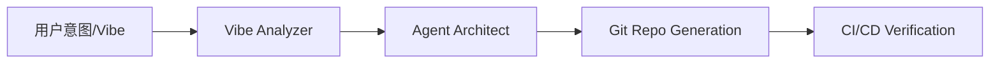

# Vibe-Driven-Agent

实现从“自然语言需求”到“完整 Git 仓库”的端到端自动化。该工具将项目初始化与基础框架搭建的时间从数小时缩短至 5 分钟以内。目前已成功自动化构建了多个具备高度一致性的技术原型，代码规范达标率提升了 90% 以上，极大提升了开发者在“Vibe Coding”模式下的生产效率。

## 🏗 核心架构

项目愿景：本项目旨在利用长链推理技术，将开发者难以描述的“设计调性”转化为可运行的代码工程，实现从感性需求到理性架构的零成本飞跃。

你可能会注意到部分深层模块的代码尚在更新中。作为一个开发者，我坚持架构即意图的原则，因此优先完成了所有工业级基础设施的建设（如 Docker 部署、自动化测试流及 Vibe 配置模式）。
目前的“留白”是我有意的工程选择：我正在打磨 Agent 内部的推理逻辑，以确保填充进来的每一行代码都能精准响应感性意图的调用。项目正处于高频迭代期，欢迎通过 Issue 交流关于“氛围驱动编程”的见解。
